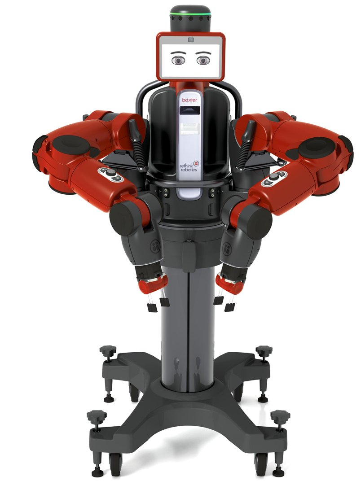

# Baxter Chess Robot

* **[Watch the demonstration video](https://youtube.com/shorts/tt5ExmPe8P8)**
* **[Read the setup and operating procedure (PDF)](docs/Baxter_Chess_Robot_Procedure.pdf)**



A robotics project for playing physical chess with a Baxter robot. The repository combines:

- **ROS Baxter motion package** for calibrating a chessboard and moving pieces.
- **Kinect + FastAPI chess controller** for detecting human moves, asking Stockfish for the robot move, and publishing Baxter-ready ROS commands.
- **Bridge scripts** that connect the Kinect/Stockfish controller to the Baxter ROS workspace.


## Demonstration and Procedure

Use the following resources to learn how to set up and operate the Baxter Chess Robot:

* **[Watch the demonstration video](https://youtube.com/shorts/tt5ExmPe8P8)**
* **[Read the setup and operating procedure (PDF)](docs/Baxter_Chess_Robot_Procedure.pdf)**

## Repository Layout


```text
baxter-chess-robot/
├── controller/                 # Kinect, FastAPI, Stockfish, Docker, and bridge code
├── ros/baxter_chess/           # ROS/catkin Baxter chess manipulation package
├── scripts/                    # Shell bridge/terminal helpers
├── docs/                       # Setup, architecture, demo, and troubleshooting notes
├── .github/workflows/          # Basic GitHub syntax check workflow
├── .gitignore
├── LICENSE
└── README.md
```

## System overview

```text
Physical board + Kinect
        │
        ▼
controller/kinect_fastapi_physical_controller_with_signal.py
        │ detects human move
        ▼
controller/api.py + Stockfish
        │ chooses robot move
        ▼
/status returns robot_ros_commands
        │
        ▼
controller/baxter_status_bridge.py or scripts/baxter_simple_terminal_loop.sh
        │
        ▼
rosrun baxter_chess move_piece.py ...
        │
        ▼
Baxter moves the physical chess piece
```

## Hardware and software prerequisites

- Rethink Robotics Baxter robot with a working Baxter ROS environment.
- Linux machine for ROS/Baxter control.
- Kinect-compatible Linux machine for camera-based board tracking.
- ROS/catkin workspace containing `baxter.sh`.
- Docker and Docker Compose for the controller workflow, or Python 3 for manual execution.
- Stockfish chess engine. The Docker image installs it automatically.

## Quick start

### 1. Clone into your ROS workspace

```bash
mkdir -p ~/ros_ws/src
cd ~/ros_ws/src
git clone https://github.com/<your-username>/baxter-chess-robot.git
cd ~/ros_ws
catkin_make
source devel/setup.bash
```

Catkin will find the ROS package at `ros/baxter_chess`.

### 2. Enable Baxter and calibrate the board

```bash
cd ~/ros_ws
source ./baxter.sh
rosrun baxter_tools enable_robot.py -e

rosrun baxter_chess gripper_setup.py --limb left
rosrun baxter_chess calibrate_board.py --limb left --captured-area
rosrun baxter_chess calibrate_home.py --limb left
```

Test before picking up pieces:

```bash
rosrun baxter_chess test_square.py --limb left --square e4 --piece pawn
rosrun baxter_chess go_home.py --limb left
```

Move one piece manually:

```bash
rosrun baxter_chess move_piece.py --limb left --from-square e2 --to-square e4 --piece pawn
```

### 3. Start the FastAPI chess server

```bash
cd ~/ros_ws/src/baxter-chess-robot/controller
docker compose up --build api
```

API endpoints:

- `http://127.0.0.1:8000/health`
- `http://127.0.0.1:8000/docs`
- `http://127.0.0.1:8000/viewer`

### 4. Start the Kinect controller

On Linux/X11:

```bash
cd ~/ros_ws/src/baxter-chess-robot/controller
xhost +local:docker
docker compose --profile kinect up --build
```

The controller exposes:

- `http://127.0.0.1:8765/health`
- `http://127.0.0.1:8765/status`

### 5. Run the Baxter bridge

From the Baxter/ROS machine:

```bash
cd ~/ros_ws/src/baxter-chess-robot/controller
python3 baxter_status_bridge.py \
  --control-url http://<KINECT_PC_IP>:8765 \
  --ros-ws ~/ros_ws \
  --ros-ip <BAXTER_PC_ROS_IP> \
  --dry-run
```

Remove `--dry-run` only after the printed command is correct and Baxter has been safely calibrated.

You can also use the terminal loop helper:

```bash
cd ~/ros_ws/src/baxter-chess-robot
CONTROL_URL=http://<KINECT_PC_IP>:8765 BAXTER_LIMB=left DRY_RUN=1 ./scripts/baxter_simple_terminal_loop.sh
```


## Safety notice

This project moves a real robot arm around a physical chessboard. Calibrate slowly, use dry-run modes first, keep the board fixed after calibration, and keep people clear of Baxter's workspace.

## License

BSD 3-Clause. See [`LICENSE`](LICENSE).
